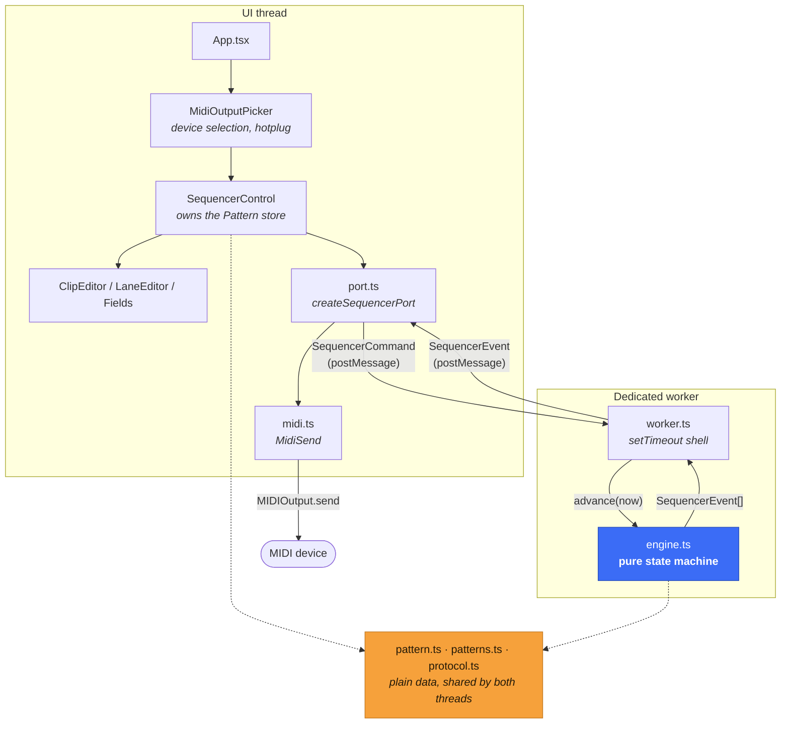
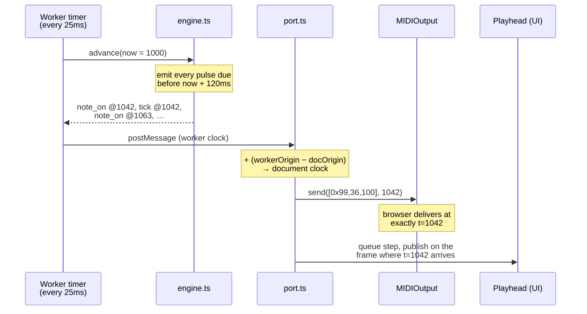
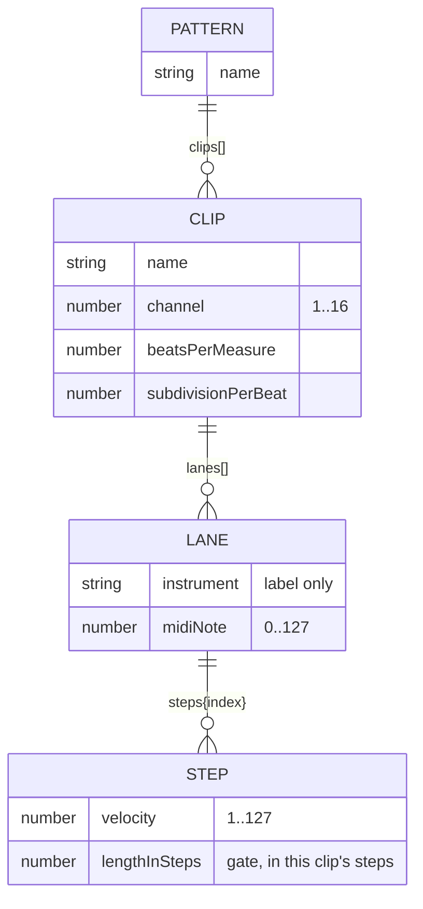

# seq

A browser MIDI step sequencer. Drive real hardware or a soft synth from a grid
of clips, with a clock that runs off the UI thread and schedules ahead so timing
does not wobble when the interface is busy.

- **Polymetric clips** — each clip loops at its own bar length, so a 3/4 clip and
  a 4/4 clip drift against each other on purpose.
- **Sample-accurate output** — events are stamped with their *ideal* time and
  handed to Web MIDI early, so `setTimeout` jitter never reaches the wire.
- **MIDI clock master** — sends 0xF8/0xFA/0xFC so external gear can sync to it.

## Quick start

Requires Node ≥ 22.12 and a browser with [Web MIDI][webmidi] (Chrome, Edge,
Opera — not Firefox or Safari).

```bash
pnpm install
pnpm dev          # http://localhost:5173
```

| Script | What it does |
| --- | --- |
| `pnpm dev` | Vite dev server with HMR |
| `pnpm build` | Production bundle into `dist/` |
| `pnpm preview` | Serve the built bundle |
| `pnpm typecheck` | `tsc --noEmit` |
| `pnpm test` | Run the suite once |
| `pnpm test:watch` | Watch mode |
| `pnpm test:coverage` | Coverage report (`coverage/`) |
| `pnpm check` | Typecheck + tests — the pre-commit gate |

## Architecture

Three concerns, deliberately kept apart: **what to play** (a plain data
`Pattern`), **when to play it** (a pure engine), and **how to say it** (MIDI
bytes). Only the thin shells around them touch a browser API.



Everything blue is pure and timer-free; everything orange is plain
structured-cloneable data. That is what makes the timing model testable —
`engine.test.ts` drives a whole performance with a fake clock and no worker.

### The scheduling model

The classic ["tale of two clocks"][twoclocks] arrangement. A coarse 25 ms timer
wakes the engine; each wake-up emits every pulse falling inside a 120 ms
lookahead window, stamped with the time it *should* sound. Web MIDI honours
future timestamps, so the browser — not `setTimeout` — decides the exact moment
bytes hit the port.



Two details that are easy to get wrong and are pinned by tests:

1. **Two clock domains.** A dedicated worker has its own `performance.timeOrigin`,
   so its `performance.now()` is *not* comparable to the document's — which is
   what `MIDIOutput.send` expects. The worker publishes its origin in a `ready`
   message and the port converts every timestamp. Skip this and every event
   lands in the past, which Web MIDI treats as "play now": it still sounds, but
   all scheduling precision is gone.
2. **The UI must not run early.** Step events arrive up to a lookahead ahead of
   time, so the port queues them and publishes each on the animation frame where
   its time actually arrives.

### Data model



Two choices worth knowing:

- **`Lane.steps` is a sparse map, not an array.** Shrinking a clip's bar length
  therefore hides notes rather than destroying them; widen it again and they
  come back.
- **A clip's grid must divide the clock.** `pulsesPerStep` returns `null` when
  `ppq % subdivisionPerBeat !== 0` (quintuplets at 24 PPQ, say). Such a clip
  falls silent with an explanation in the UI, because rounding would smear its
  notes onto the wrong beats. Raising PPQ to a multiple fixes it.

## Testing

```bash
pnpm test
```

101 tests, ~98% statement coverage. The layering is what makes this cheap: the
engine is a pure function of time, so its suite asserts on exact event streams
rather than on sounds.

| Suite | Covers |
| --- | --- |
| `engine.test.ts` | Pulse rate, drift, catch-up, gate lengths, retriggering, polymeter, stop-releases-all |
| `pattern.test.ts` | Grid maths, clamping, validation, the starter pattern |
| `midi.test.ts` | Exact status bytes, channel packing, data-byte clamping |
| `port.test.ts` | Clock-domain translation, playhead scheduling, teardown |
| `worker.test.ts` | Timer lifecycle — starts, stops, never stacks or leaks |
| `*.test.tsx` | The UI, asserted through what reaches the worker and the port |

`src/test/fakes.ts` holds the stubs for the three things jsdom lacks: `Worker`,
Web MIDI, and controllable animation frames.

## Notes on this rewrite

The app was a SolidStart 1 / vinxi project. It is now a plain Vite 8 SPA.

**Why.** There is no server-side surface here at all — no routes, no server
functions, no data loading — and Web MIDI needs a browser regardless, so SSR was
pure build-time overhead. SolidStart 2 (which drops vinxi for Vite 8 directly)
would have been the modern alternative, but it requires **Node 24** and this
project targets Node 22. Dropping the framework removed two large dependencies
and unblocked current tooling.

**To go back to SolidStart:** restore `app.config.ts` (or `vite.config.ts` with
the `solidStart()` plugin on v2), re-add `entry-client.tsx` / `entry-server.tsx`,
and move `App.tsx` to `src/app.tsx`. Nothing under `src/sequencer/` assumes a
particular framework — only `port.ts` touches Solid, and only for reactivity.

### Bugs fixed along the way

| | |
| --- | --- |
| **Clock ran in pairs** | The catch-up loop recomputed elapsed time *before* advancing its reference point, so every timer callback emitted exactly two pulses and then slept twice as long. Average tempo was right; the jitter was 100%. |
| **Notes hung on stop** | `stop` cleared the active-note list without sending note-offs. Anything sounding stayed sounding. Stop and teardown now release every note, and there is a Panic button. |
| **Worker/document clock mismatch** | Worker timestamps were passed straight to `MIDIOutput.send`, which reads them on the document's clock. See above. |
| **`onCleanup(worker.terminate)`** | An unbound method reference — throws `Illegal invocation` in a browser, so the worker was never terminated. |
| **Empty BPM field froze the tab** | `+e.currentTarget.value` turned `""` into `0`, and a zero or negative interval made the catch-up loop never terminate. Inputs now reject `NaN` and the engine clamps. |
| **Corrupt status bytes** | `0x90 + (channel - 1)` with a channel outside 1–16 carried into the status nibble, turning note-ons into other messages. Now masked and clamped, along with every data byte. |
| **Silent clips** | A subdivision that did not divide PPQ meant `pulseCount % 4.8 === 0` was never true, so the clip just never played, with no indication why. |
| **Retriggered notes stuck** | Re-firing a still-sounding pitch queued a second note-off; the first cut the new note short and the second was never matched. The engine now releases before retriggering. |
| **Stuck audition notes** | Pressing the trigger button and dragging away skipped `pointerup`. Now uses pointer capture. |
| **Whole grid re-rendered per keystroke** | `<For each={Array.from(clips.entries())}>` rebuilt every tuple on any change. Replaced with a `createStore` and direct `<For each={pattern.clips}>`. |

### Other changes

- **Dropped `immer`.** Solid's `createStore` + `produce` covers every edit the
  app makes, with fine-grained reactivity as a bonus — one fewer dependency and
  markedly less code per edit.
- **Lookahead scheduling** and a catch-up cap, so a backgrounded tab resyncs
  instead of flooding the port with thousands of replayed pulses on wake.
- **Web MIDI is handled properly**: unsupported browsers and denied permission
  get an explanation, `statechange` tracks hotplug, and ports are keyed by `id`
  rather than name (names are neither unique nor guaranteed non-empty). `sysex`
  is no longer requested — it triggered a stricter prompt for no reason.
- **Playhead display**, dark mode, and a real stylesheet.
- Deleted `src/worker.ts`, an unused earlier copy of the clock.

### Known gaps

- No persistence — reloading loses the pattern.
- Velocity is fixed at 100 per step; the model supports 1–127 but there is no
  editor for it. Same for gate length beyond the default of one step.
- No MIDI input, so the app can only be clock *master*, never slave.
- Changing PPQ mid-playback keeps the pulse counter, so clips shift in time.
  Harmless, but it is a "stop first" operation in practice.

[webmidi]: https://developer.mozilla.org/en-US/docs/Web/API/Web_MIDI_API
[twoclocks]: https://web.dev/articles/audio-scheduling
