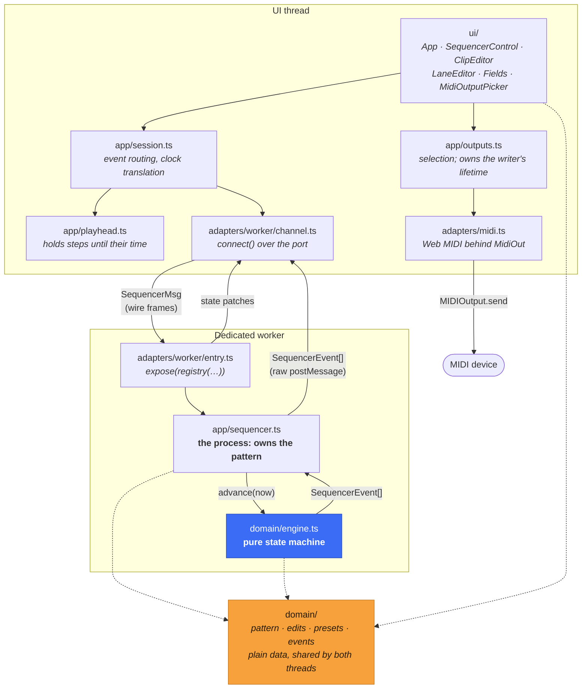
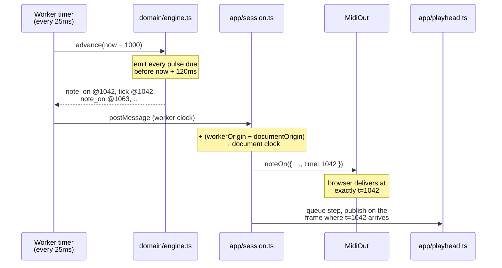
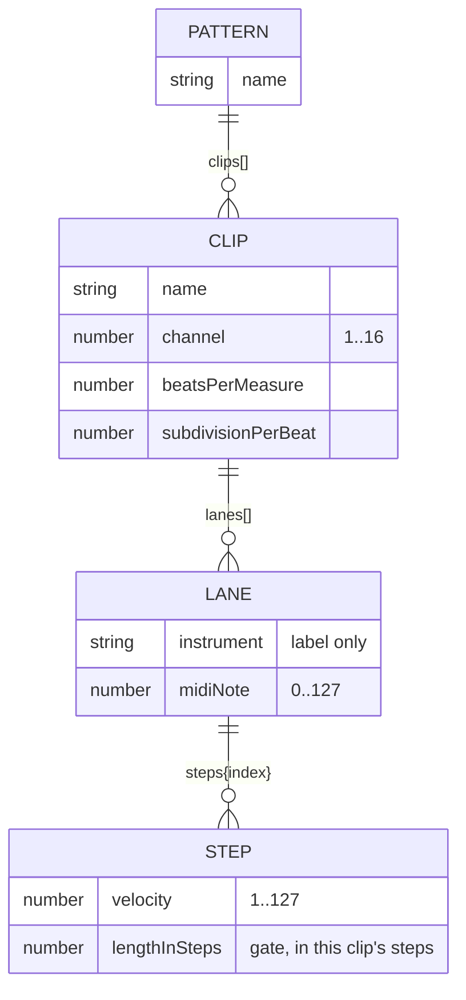

# seq

A browser MIDI step sequencer for hardware and software synths. Its clock runs
off the UI thread and schedules events ahead of time, so a busy interface does
not throw off the timing.

- **Polymetric clips** — each clip has its own bar length, so 3/4 and 4/4 clips
  can loop against each other.
- **Sample-accurate output** — events carry their intended timestamps and are
  sent to Web MIDI early, keeping `setTimeout` jitter out of the MIDI stream.
- **MIDI clock master** — sends 0xF8/0xFA/0xFC so external gear can sync to it.

## Quick start

Requires Node ≥ 22.12 and a browser with [Web MIDI][webmidi] (Chrome, Edge,
Opera — not Firefox or Safari).

```bash
pnpm install
pnpm dev          # http://localhost:5173
```

| Script | What it does |
| --- | --- |
| `pnpm dev` | Vite dev server with HMR |
| `pnpm build` | Production bundle into `dist/` |
| `pnpm preview` | Serve the built bundle |
| `pnpm typecheck` | `tsc --noEmit` |
| `pnpm test` | Run the suite once |
| `pnpm test:watch` | Watch mode |
| `pnpm test:coverage` | Coverage report (`coverage/`) |
| `pnpm check` | Typecheck + tests — the pre-commit gate |

### Dependency note

The UI uses [nonchalant][nonchalant]. It is installed from GitHub because it is
not published to npm. Its packages refer to one another through pnpm's
`workspace:` protocol, which does not resolve in a Git dependency, so the
`pnpm.overrides` block in `package.json` points those references back to the
same repository. The package also ships TypeScript source with explicit `.ts`
imports, hence `allowImportingTsExtensions` in `tsconfig.json`.

## Architecture

The code separates **what to play** (a plain `Pattern`), **when to play it** (a
pure engine), and **how to send it** (MIDI bytes). Dependencies point inward
toward the domain.

```
        ui/  ─────────┐
                      ├────▶  app/  ────▶  domain/
        adapters/ ────┘         ▲
                                └── ports.ts: interfaces implemented by
                                    adapters in production and fakes in tests
```

| layer | knows about | contains |
| --- | --- | --- |
| `domain/` | nothing | the `Pattern`, the edits, the engine, the events it emits |
| `app/` | `domain/`, its own ports, `@nonchalant/core` | the processes: the sequencer, the playhead, output selection |
| `adapters/` | everything | Web MIDI, the worker, the wire, the clock |
| `ui/` | `app/`, `domain/`, `@nonchalant/dom` | views: functions from processes to `VNode` |
| `main.ts` | both sides | the composition root where they are wired together |

[`app/ports.ts`](src/app/ports.ts) defines the boundary. Code in `app/` does not
depend on `MIDIOutput`, `performance.now()`, `requestAnimationFrame`, or the
worker transport. Production adapters implement those interfaces; tests use
small in-memory implementations. No mocks are used.

[`architecture.test.ts`](src/architecture.test.ts) enforces the dependency
rules by checking every import under `src/`. `@nonchalant/core` is available to
the application layers above the domain. Rendering and transport packages
(`@nonchalant/dom` and `@nonchalant/wire`) are limited to `ui/` and `adapters/`.

### Asking for MIDI

Browsers prompt for MIDI access whether or not `sysex` is requested — that is
what the `[Deprecation]` console notice is announcing, and it cannot be silenced
without asking for more access than the app needs. They are also entitled to
suppress a prompt that no interaction asked for, in which case the request hangs
or is refused on the user's behalf.

So [`app/outputs.ts`](src/app/outputs.ts) asks what *would* happen before asking
for anything, and permission is a state rather than a step:

| status | what the user sees |
| --- | --- |
| `idle` | "Looking for MIDI support…" |
| `unsupported` | which browsers have Web MIDI |
| `prompt` | an **Enable MIDI** button — the gesture the browser wants |
| `asking` | "Waiting for permission", and where to look if no prompt appeared |
| `denied` | the reason, and a **Try again** button |
| `ready` | the port list, or **Look again** if nothing is attached |

When access works but no output is reported, the panel names any MIDI *inputs*
it can see. An interface with MIDI usually exposes an In and an Out together, so
that distinguishes "the browser cannot see this device" from "something else
already has its output open" — on Windows a MIDI output can only be open in one
application at a time.

Already-granted permission skips the button: no prompt will appear, so there is
nothing for a gesture to protect. Every other stage renders something, because
"nothing is happening yet" is a thing the user needs told — an earlier version
drew an empty panel while it waited, which is indistinguishable from a broken
app.

### Where the state lives

The worker owns the pattern; the UI thread keeps a live copy. A step edit sends
one message to the worker and receives a patch in return, rather than copying
the whole pattern in either direction. Only bindings that read the changed step
are updated. [`SequencerControl.test.ts`](src/ui/SequencerControl.test.ts)
checks that toggling one step in a 48-button grid touches one button.



Blue marks pure, timer-free code; orange marks plain structured-cloneable data.
This lets `engine.test.ts` drive a performance with a fake clock and no worker.
`sequencer.test.ts` tests the process around the engine the same way.

### Two channels over one port

The two threads exchange state and MIDI events through different channels.

**State** — tempo, resolution, pattern, and transport status — travels over
nonchalant's wire as data patches. The worker owns the state, the UI reads its
local copy, and edits are sent back as casts.

**MIDI events** — note-ons, note-offs, clock pulses, and playhead steps — use the
worker's raw `postMessage` channel. Unlike state, every event must arrive once.
A process value stream only retains its latest value, so it cannot safely carry
scheduled notes. Polling for events once per animation frame would tie MIDI
timing to the UI thread again.

Both channels share one `Worker`. Nonchalant's `portTransport` only handles
string payloads, so structured-cloned event batches pass through separately
without extra multiplexing. [`SequencerChannel`](src/app/ports.ts) hides both
behind one interface, with an in-memory implementation for tests.

### The scheduling model

The scheduler follows the ["tale of two clocks"][twoclocks] pattern. A 25 ms
timer wakes the engine, which emits every pulse due within the next 120 ms. Each
event carries its intended playback time. Web MIDI honours future timestamps,
so the browser decides when the bytes reach the port; `setTimeout` only needs to
wake up early enough.



Two details matter here:

1. **Two clock domains.** A dedicated worker has its own `performance.timeOrigin`,
   so its `performance.now()` is *not* comparable to the document timeline used
   by `MIDIOutput.send`. The worker publishes its origin as part of its state,
   and `app/session.ts` converts every timestamp. Without the conversion, Web
   MIDI sees the events as being in the past and plays them immediately.
   Port messages are ordered, and the initial state snapshot includes the
   origin before playback can start.
2. **The UI must not run early.** Step events can arrive 120 ms early, so
   `app/playhead.ts` queues them and publishes each on the animation frame when
   its timestamp is reached.

### Data model



Some details of the model:

- **`Lane.steps` is a sparse map, not an array.** Shortening a clip hides notes
  beyond its new bar length instead of deleting them. Lengthen it again and the
  notes return.
- **A clip's grid must divide the clock.** `pulsesPerStep` returns `null` when
  `ppq % subdivisionPerBeat !== 0` (quintuplets at 24 PPQ, say). Such a clip
  does not play, and the UI explains why. Rounding would put notes on the wrong
  beats; raising PPQ to a compatible multiple fixes it.
- **Every edit is immutable and shares what it did not change**
  ([`domain/edits.ts`](src/domain/edits.ts)). This keeps patch generation
  proportional to the edit rather than the size of the pattern. A no-op, such
  as deleting a missing index or renaming something to its current name,
  returns the original object and produces no patch.

## Testing

```bash
pnpm test
```

The suite has 160 tests. Domain code is pure, and processes receive their clock,
timer, and output port as arguments. Tests can therefore compare exact event
streams without relying on real time or audible output.

| Suite | Covers |
| --- | --- |
| `domain/engine.test.ts` | Pulse rate, drift, catch-up, gate lengths, retriggering, polymeter, stop-releases-all |
| `domain/pattern.test.ts` | Grid maths, clamping, validation, the starter pattern |
| `domain/edits.test.ts` | Pattern edits, structural sharing, and no-op edits |
| `app/sequencer.test.ts` | The process: timer lifecycle, transport, and editing while playing — no worker, no real timer |
| `app/playhead.test.ts` | Frame-accurate scheduling of the display |
| `app/outputs.test.ts` | The permission ladder, hotplug, rescanning, and the lifetime of the writer |
| `app/session.test.ts` | Clock-domain translation, the wire round trip, teardown |
| `adapters/midi.test.ts` | Exact status bytes, channel packing, data-byte clamping, the port directory |
| `adapters/worker/entry.test.ts` | The worker over a real `MessagePort`: handshake, edits, and both channels sharing it |
| `ui/*.test.ts` | Views, sequencer/output interactions, and update granularity |
| `architecture.test.ts` | Dependency rules |

There are no mocks. [`src/test/fakes.ts`](src/test/fakes.ts) provides direct
implementations of the ports: an incrementable clock, a queued timer, and a
MIDI output that records messages. Its `memoryChannel` runs the real sequencer
process and wire transport in the test thread. Only the worker boundary and
clock are replaced. [`src/test/render.ts`](src/test/render.ts) mounts views and
reports which elements an update touched.

## Rewrite notes

The app started as a SolidStart 1 / vinxi project, then moved to a plain Vite 8
SPA. It now uses [nonchalant][nonchalant], a process-based UI runtime that keeps
state in async generators and updates views with path-scoped patches.

**Why SolidStart was removed.** The app has no routes, server functions, or
server-side data loading, and Web MIDI requires a browser. Server rendering was
adding build complexity without doing useful work.

**Why nonchalant.** The worker already handled sequencing, but the app copied
the entire pattern across `postMessage` after every edit. Nonchalant sends state
patches, which lets the worker own the pattern and send back only what changed:

- An edit is one message, followed by a patch containing the changed paths. The
  old `set_pattern` message is gone.
- The UI copy is no longer a second source of truth. The worker owns the state;
  the UI keeps a patched copy for rendering.
- MIDI device switching is managed by the process that owns the writer
  ([`app/outputs.ts`](src/app/outputs.ts)). The Solid version achieved the same
  cleanup indirectly by remounting a keyed component.

**What stayed the same.** The engine, pattern model, MIDI byte-packing, and their
tests did not need framework-specific changes.

**Upstream fix.** Nonchalant treated every boolean attribute like an HTML
boolean attribute, so `aria-pressed={false}` removed the attribute instead of
rendering `"false"`. It now stringifies `aria-*` values.

### Bugs fixed along the way

| | |
| --- | --- |
| **Clock ran in pairs** | The catch-up loop recomputed elapsed time before advancing its reference point. Each timer callback emitted two pulses, then waited twice as long. The average tempo was right, but the timing was not. |
| **Notes hung on stop** | `stop` cleared the active-note list without sending note-offs. Anything sounding stayed sounding. Stop and teardown now release every note, and there is a Panic button. |
| **Worker/document clock mismatch** | Worker timestamps were passed straight to `MIDIOutput.send`, which reads them on the document's clock. See above. |
| **Worker cleanup failed** | `onCleanup(worker.terminate)` passed an unbound method, which throws `Illegal invocation` in a browser. The worker was never terminated. |
| **Empty BPM field froze the tab** | `+e.currentTarget.value` turned `""` into `0`, and a zero or negative interval made the catch-up loop never terminate. Inputs now reject `NaN` and the engine clamps. |
| **Corrupt status bytes** | `0x90 + (channel - 1)` with a channel outside 1–16 carried into the status nibble, turning note-ons into other messages. Now masked and clamped, along with every data byte. |
| **Silent clips** | If a subdivision did not divide PPQ, a check such as `pulseCount % 4.8 === 0` never passed. The clip now reports the incompatible subdivision. |
| **Retriggered notes stuck** | Re-firing a still-sounding pitch queued a second note-off; the first cut the new note short and the second was never matched. The engine now releases before retriggering. |
| **Stuck audition notes** | Dragging away from the trigger button could skip `pointerup`. The button now uses pointer capture. |
| **Whole grid re-rendered per keystroke** | `<For each={Array.from(clips.entries())}>` rebuilt every tuple on any change. Lists are now keyed by count, so edits update only the bindings that read the changed value. |
| **Two timer chains after stop-then-start** | A wake-up already scheduled when the transport stopped would still fire, and a fresh start armed another beside it. The process arms at most one. |

### Other changes

- Removed `immer` and Solid stores. Edits are pure functions over plain data.
- Added lookahead scheduling and a catch-up limit. A backgrounded tab resyncs on
  wake instead of replaying thousands of old pulses.
- Added clear errors for unsupported browsers and denied Web MIDI permission,
  plus hotplug support. Ports are keyed by `id`, since names may be empty or
  duplicated. `sysex` access is not requested: the app only sends channel-voice
  and real-time messages. Note that this buys least privilege, not a quieter
  prompt — Chrome asks for permission either way, and says so with a
  `[Deprecation]` console notice that cannot be silenced without requesting
  more access than the app needs.
- Added a playhead display, dark mode, and a full stylesheet.

### Known gaps

- No persistence — reloading loses the pattern.
- Velocity is fixed at 100 per step; the model supports 1–127 but there is no
  editor for it. Same for gate length beyond the default of one step.
- No MIDI input, so the app can only be clock *master*, never slave.
- Changing PPQ during playback keeps the current pulse counter, which shifts
  clips in time. Stop playback before changing it.
- Text and number fields display the value returned by the worker after two
  `postMessage` hops. This is normally faster than typing, but a slow or stuck
  worker would also make the fields lag.

[webmidi]: https://developer.mozilla.org/en-US/docs/Web/API/Web_MIDI_API
[twoclocks]: https://web.dev/articles/audio-scheduling
[nonchalant]: https://github.com/twfarland/nonchalant
